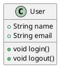

# Markdown Preview Enhanced

## 概要

Markdown Preview Enhancedは、Visual Studio Code（VS Code）でMarkdownファイルを高度にプレビュー・編集するための拡張機能です。通常のMarkdownプレビューを大幅に拡張し、数式、図表、プレゼンテーション、PDFエクスポートなど、豊富な機能を提供します。

## 主な機能

### 1. 高度なプレビュー機能
- **リアルタイムプレビュー**: 編集中のMarkdownをリアルタイムでプレビュー
- **サイドバイサイド表示**: エディタとプレビューを並べて表示
- **スクロール同期**: エディタとプレビューのスクロール位置を同期
- **カスタムCSS**: プレビューのスタイルを完全にカスタマイズ可能

### 2. 数式・図表サポート
- **LaTeX数式**: インライン数式（`$...$`）とブロック数式（`$$...$$`）をサポート
- **Mermaid図表**: フローチャート、シーケンス図、ガントチャートなどを描画
- **PlantUML**: UML図、ER図、クラス図などを描画
- **Graphviz**: グラフ構造の可視化
- **コードチャート**: プログラミング言語のコードから図表を生成

### 3. プレゼンテーション機能
- **Reveal.js**: スライド形式でのプレゼンテーション
- **Impress.js**: 3D効果付きプレゼンテーション
- **Slidev**: Vue.jsベースのモダンなプレゼンテーション
- **カスタムテーマ**: プレゼンテーションのテーマをカスタマイズ

### 4. エクスポート機能
- **HTML**: スタイル付きHTMLファイルにエクスポート
- **PDF**: 高品質なPDFファイルにエクスポート
- **PNG/JPG**: 画像ファイルとしてエクスポート
- **Word**: Microsoft Word文書にエクスポート
- **LaTeX**: LaTeX文書にエクスポート

### 5. インタラクティブ機能
- **JavaScript実行**: プレビュー内でJavaScriptを実行
- **CSSアニメーション**: カスタムCSSアニメーションの表示
- **外部コンテンツ**: YouTube動画、Google Mapsなどの埋め込み
- **ライブリロード**: 外部ファイルの変更を自動反映

## キーボードショートカット

### Windows/Linux版
- **プレビュー表示**: `Ctrl+K V` でサイドバイサイドプレビュー
- **プレビュー更新**: `Ctrl+Shift+V` でプレビューを開く
- **プレゼンテーション**: `Ctrl+Shift+P` → "Markdown Preview Enhanced: Open Preview to the Side"
- **エクスポート**: `Ctrl+Shift+P` → "Markdown Preview Enhanced: Export to PDF"

### Mac版
- **プレビュー表示**: `Cmd+K V` でサイドバイサイドプレビュー
- **プレビュー更新**: `Cmd+Shift+V` でプレビューを開く
- **プレゼンテーション**: `Cmd+Shift+P` → "Markdown Preview Enhanced: Open Preview to the Side"
- **エクスポート**: `Cmd+Shift+P` → "Markdown Preview Enhanced: Export to PDF"

## 設定オプション

### 基本設定
```json
{
    "markdown-preview-enhanced.enableTypographer": true,
    "markdown-preview-enhanced.enableExtendedTableSyntax": true,
    "markdown-preview-enhanced.enableTypographer": true,
    "markdown-preview-enhanced.frontMatterRenderingOption": "table"
}
```

### プレビュー設定
```json
{
    "markdown-preview-enhanced.previewTheme": "github-light.css",
    "markdown-preview-enhanced.codeBlockTheme": "github.css",
    "markdown-preview-enhanced.revealjsTheme": "white.css",
    "markdown-preview-enhanced.enableScriptExecution": false
}
```

### エクスポート設定
```json
{
    "markdown-preview-enhanced.pdfExportFormat": "A4",
    "markdown-preview-enhanced.pdfExportMargin": "1in",
    "markdown-preview-enhanced.htmlExportFormat": "html",
    "markdown-preview-enhanced.enableTypographer": true
}
```

## 使用方法

### 1. インストール
1. VS Codeを開く
2. 拡張機能タブ（`Cmd+Shift+X` / `Ctrl+Shift+X`）を開く
3. "Markdown Preview Enhanced"を検索
4. インストールボタンをクリック

### 2. 基本的な使い方
- **プレビュー表示**: `Cmd+K V`（Mac） / `Ctrl+K V`（Windows/Linux）
- **プレビュー更新**: `Cmd+Shift+V`（Mac） / `Ctrl+Shift+V`（Windows/Linux）
- **プレゼンテーション**: コマンドパレットから「Markdown Preview Enhanced: Open Preview to the Side」

### 3. 数式の使用
```markdown
# インライン数式
$E = mc^2$

# ブロック数式
$$
\int_{-\infty}^{\infty} e^{-x^2} dx = \sqrt{\pi}
$$
```

### 4. Mermaid図表の使用
```markdown

```

### 5. PlantUMLの使用
```markdown

```

## 高度な機能

### 1. プレゼンテーション作成
```markdown
---
presentation:
  theme: white.css
  transition: slide
---

# スライド1
内容

---

# スライド2
内容
```

### 2. カスタムCSS
```markdown
<style>
.custom-style {
    color: blue;
    font-size: 18px;
}
</style>

<div class="custom-style">
カスタムスタイルのテキスト
</div>
```

### 3. JavaScript実行
```markdown
<script>
console.log('Hello from Markdown!');
document.body.style.backgroundColor = '#f0f0f0';
</script>
```

### 4. 外部コンテンツ埋め込み
```markdown
@[youtube](https://www.youtube.com/watch?v=dQw4w9WgXcQ)

@[google-map](https://maps.google.com/maps?q=Tokyo)
```

## プロジェクトでの活用

### 技術文書
- **API仕様書**: 数式や図表を含む詳細な仕様書
- **アーキテクチャドキュメント**: UML図やフローチャート付き設計書
- **技術レポート**: 数式やグラフを含む研究レポート

### プレゼンテーション
- **技術発表**: 開発成果のプレゼンテーション
- **設計レビュー**: システム設計の説明資料
- **トレーニング**: チーム内研修資料

### レポート・論文
- **研究論文**: 数式や図表を含む学術論文
- **ビジネスレポート**: データ分析結果の報告書
- **技術記事**: ブログや技術記事

## ベストプラクティス

### 1. ファイル構造
```
docs/
├── presentations/
│   ├── architecture-review.md
│   └── project-overview.md
├── technical/
│   ├── api-specification.md
│   └── system-design.md
└── reports/
    ├── performance-analysis.md
    └── security-audit.md
```

### 2. プレゼンテーション作成
- **スライド分割**: 1つのトピックにつき1スライド
- **視覚的要素**: 図表や数式を効果的に活用
- **テーマ統一**: 一貫したデザインテーマを使用

### 3. 数式・図表の管理
- **ファイル分離**: 複雑な図表は別ファイルで管理
- **バージョン管理**: 図表の変更履歴を記録
- **再利用**: 共通の図表はテンプレート化

## トラブルシューティング

### よくある問題
1. **プレビューが表示されない**
   - 拡張機能が正しくインストールされているか確認
   - VS Codeを再起動
   - ファイル拡張子が `.md` になっているか確認

2. **数式が表示されない**
   - LaTeX構文が正しいか確認
   - 数式エンジンが有効になっているか確認

3. **図表が描画されない**
   - Mermaid/PlantUMLの構文が正しいか確認
   - 必要な依存関係がインストールされているか確認

4. **エクスポートが失敗する**
   - ファイルパスに特殊文字が含まれていないか確認
   - 必要な権限があるか確認

### パフォーマンス最適化
- **大きなファイル**: 1000行を超えるファイルは分割を検討
- **複雑な図表**: 図表の複雑さを適度に保つ
- **外部リンク**: 過度に多くの外部リンクは避ける

## 関連拡張機能

### 推奨拡張機能
- **Markdown All in One**: 基本的なMarkdown編集機能
- **markdownlint**: Markdownの文法チェック
- **Paste Image**: 画像の貼り付け機能
- **Auto-Open Markdown Preview**: 自動でプレビューを開く

### 連携可能な拡張機能
- **GitLens**: Git履歴との連携
- **Draw.io Integration**: 図表の作成・編集
- **LaTeX Workshop**: LaTeX文書の編集
- **Mermaid Preview**: フローチャートの作成

## まとめ

Markdown Preview Enhancedは、Markdownの可能性を大幅に拡張する強力なツールです。数式、図表、プレゼンテーション、エクスポート機能により、技術文書からプレゼンテーションまで、幅広い用途に対応できます。

**Mac版では `Ctrl` の代わりに `Cmd` キーを使用する**という点が主な違いですが、機能自体は全OSで同じように動作します。この拡張機能を活用することで、技術文書の品質と表現力が大幅に向上し、チーム間のコミュニケーションもより効果的になります。
