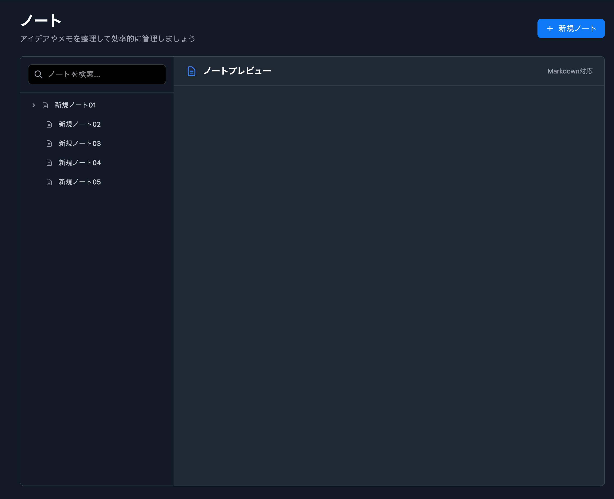

# ノート一覧画面 - 仕様書

## 概要
ノート一覧画面はユーザーがノートを管理するためのメイン画面です。
ノートの作成・閲覧が可能です。

## 画面仕様

### 基本情報
- **画面名**: ノート一覧画面
- **URL**: `/notes`
- **HTTPメソッド**: GET
- **テンプレート**: `pages/note/list.html`
- **コントローラー**: `NoteController`

### 画面レイアウト

#### 画面イメージ



#### ヘッダー部分
- ページタイトル：ノート
- サブタイトル：アイデアやメモを整理して効率的に管理しましょう

#### サイドメニュー
- ノート検索
検索フォームに入力して結果をモーダル表示します。 
- ノート一覧
ノートの一覧を表示します。
各ノートカードには以下の機能を搭載。
  - ノート参照(メインコンテンツにノートを表示)
  - ノート作成
  - ノート削除 

#### メインコンテンツ
- ノートプレビューを表示
  - プレビューにはToast UIを使用する

#### 項目情報
| 項目ID | 項目名               |       データソース        | 桁数  | 必須  | 編集可否 | 入力方式 | デフォルト値 | コメント                   |
| :----: | -------------------- | :-----------------------: | :---: | :---: | :------: | :------: | :----------: | -------------------------- |
|   01   | タイトル             |        notes.title        |  50   |   ◯   |    ×     |    -     |      -       | 押下時にプレビューを表示。 |
|   02   | 検索フォーム         | notes.title,notes.content |   -   |   -   |    ◯     | テキスト |      -       |                            |
|   03   | ノートプレビュー     |       notes.content       |   -   |   -   |    ×     |    -     |      -       |                            |
|   04   | 新規ノート作成ボタン |                           |   -   |   -   |    ×     |    -     |      -       |                            |
## データモデル

### Noteエンティティ
```java
@Data
@Entity
@Table(name = "notes")
public class Note {
    @Id
    @GeneratedValue(strategy = GenerationType.IDENTITY)
    private Long id;

    @Column(nullable = false)
    private String title;

    @Column(columnDefinition = "TEXT")
    private String content;

    @Column(name = "user_id", nullable = false)
    private Long userId;

    @Column(name = "parent_id")
    private Long parentId;

    @Column(name = "created_at")
    private LocalDateTime createdAt;

    @Column(name = "updated_at")
    private LocalDateTime updatedAt;

    @PrePersist
    protected void onCreate() {
        createdAt = LocalDateTime.now();
        updatedAt = LocalDateTime.now();
    }

    @PreUpdate
    protected void onUpdate() {
        updatedAt = LocalDateTime.now();
    }
}
```
## 機能仕様

### 1. ノート一覧表示
- **機能**: ノートのタイトルを表示
- **表示項目**:
  - タイトル
  - 編集ボタン
  - 削除ボタン
- **表示順**: ID昇順

#### 1-1. 編集ボタン
- **トリガー**: 編集ボタンをクリック
- **機能**: ノート編集画面を開く。 
```java
GET `/notes/{id}`
```
#### 1-2. 削除ボタン
- **トリガー**: 削除ボタンをクリック
- **API**: DELETE `/api/notes/{id}`

### 2. ノート新規作成

- **トリガー**: 新規ノートボタンをクリック
- **機能**: 新規ノートを作成し、ノート一覧に追加する

### 3. ノート検索
- **トリガー**: 検索フォームに入力
- **機能**: 検索フォームの値を使ってタイトル・コンテンツを検索する
- **API**: GET `/api/notes/search`

### 4. ノートプレビュー
- **機能**: ノート一覧で選択したノートを表示する
- **API**: GET `/api/notes/{id}`